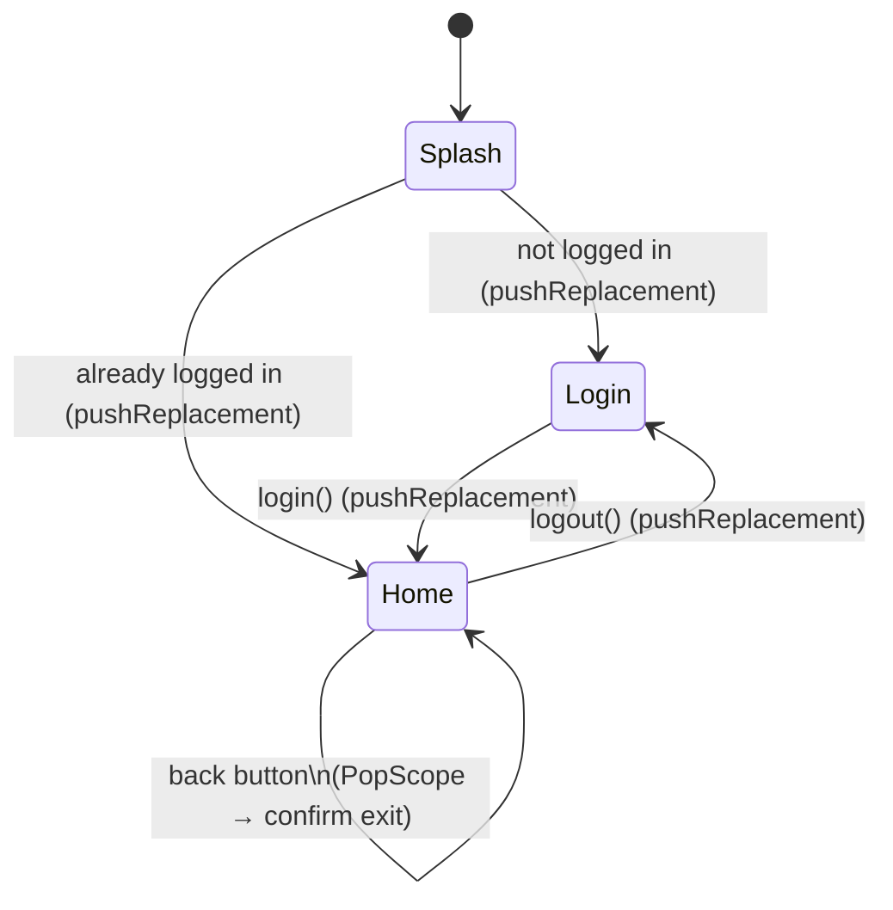

# Navigation

How Flutter's `Navigator` compares to React Navigation's stack, and how this project wires Splash → Login → Home together, plus how `AppSideMenu` avoids stacking duplicate screens. The actual code lives in [`lib/screens/`](../screens/) (`splash_screen.dart`, `login_screen.dart`, `home_screen.dart`, `settings_screen.dart`, `privacy_screen.dart`), [`lib/navigation/app_routes.dart`](app_routes.dart), and [`lib/widgets/layout/sidemenu/app_side_menu.dart`](../widgets/layout/sidemenu/app_side_menu.dart).

## 1. The stack, and how it maps to what you already know

Flutter's `Navigator` is a stack of `Route`s, same mental model as React Navigation:

```
[Splash] → push → [Splash, Login] → push → [Splash, Login, Home]
```

- **`push`** adds a route on top. **`pop`** removes the top route and goes back to whatever is now on top.
- There is **no "forward"**. Once a route is popped, its `State` is disposed — it doesn't sit in some forward-history waiting to be revisited, like a browser tab's forward button. This matches React Navigation, not the browser: the only way to see a popped screen again is to `push` a new instance of it.
- A route is a widget wrapped in something like `MaterialPageRoute` (gives you the platform's push/pop transition for free):
  ```dart
  Navigator.of(context).push(
    MaterialPageRoute(builder: (_) => const SomeScreen()),
  );
  ```

## 2. Push/pop family — what's available

| Method | What it does |
|---|---|
| `Navigator.push(route)` | Adds a route on top of the stack. |
| `Navigator.pop([result])` | Removes the top route; optionally hands a `result` value back to whoever `await`ed the `push`. |
| `Navigator.maybePop()` | Like `pop`, but does nothing (returns `false`) if the current route refuses to pop (e.g. it has unsaved changes) or if there's nothing below it. |
| `Navigator.canPop()` | Whether `pop` would actually do anything right now. |
| `Navigator.pushReplacement(route)` | Swaps the **current top route** for a new one. The old route is disposed and gone from the stack — going back afterward skips it entirely, landing on whatever was below it. **This is the one this project uses for Splash→Login/Home, Login→Home, and Home→Login (logout)** — see section 3. |
| `Navigator.popUntil(predicate)` | Pops repeatedly until `predicate(route)` is true (e.g. `route.isFirst`) — "go back several screens at once". |
| `Navigator.pushAndRemoveUntil(route, predicate)` | Pushes a new route and removes every route below it until `predicate` is true — "push this, and throw away everything back to X". Useful for "log out and nuke the whole stack down to a fresh Login", if a single `pushReplacement` isn't enough because there were several screens stacked on top of Home. |

There are also `*Named` variants (`pushNamed`, `pushReplacementNamed`, ...) that look up a route by a `String` name registered in `MaterialApp.routes`/`onGenerateRoute`, instead of building the widget inline. This project doesn't use named routes — screens are pushed directly by widget (`MaterialPageRoute(builder: (_) => const LoginScreen())`) since there are only 3 of them and no deep-linking need yet. If the app grows a lot of screens or needs URL-based deep links later, that's when reaching for named routes or a declarative router (`go_router`) starts paying off — not needed for this template today.

## 3. This project's flow



- **`SplashScreen`** ([`lib/screens/splash_screen.dart`](../screens/splash_screen.dart)) is `MaterialApp.home` — the very first route. Its `initState` awaits `ThemeController.instance.loadPersistedPreference()` and `LangController.instance.loadPersistedPreference()` (this used to run in `main()`, before `runApp`; it moved here once there was an actual screen to show meanwhile — see the theme/localization READMEs). Once loaded, it checks `AuthController.instance.isLoggedIn` and calls `pushReplacement` to either `LoginScreen` or `HomePage`.
- **`LoginScreen`** ([`lib/screens/login_screen.dart`](../screens/login_screen.dart)) is the app's "index" while logged out. Its button calls `AuthController.instance.login()` then `pushReplacement`s to `HomePage`.
- **`HomePage`** (in `main.dart`) is "Home". Its Settings tab has a Logout button calling `AuthController.instance.logout()` then `pushReplacement`ing back to `LoginScreen`.

`AuthController` ([`lib/controllers/auth_controller.dart`](../controllers/auth_controller.dart)) is intentionally a bare `ChangeNotifier` with an in-memory `bool isLoggedIn` — no real backend, no persistence. It exists only to drive this navigation demo; closing the app always resets it to logged out. Wiring it to real credentials/persistence is future work, same "later" as the theme/locale account-sync spot documented in those controllers.

### Why `pushReplacement` everywhere here, and not `push`/`pop`

Using `pushReplacement` at every one of these transitions is what makes "Login no longer reachable by going back once logged in" true: `pushReplacement` doesn't just add to the stack, it **removes the route it replaces**. So:

- After Splash → Home, the stack is just `[Home]` — Splash never existed as far as `pop` is concerned.
- After Login → Home, the stack is `[Home]` — Login is gone, not "beneath" Home. Pressing back on Home has nothing Login-related to return to.
- After Home → Login (logout), the stack is `[Login]` — Home is gone the same way. It's not deleted from the codebase, obviously — `HomePage` still exists and gets a **new** instance the next time `LoginScreen` pushes it, with fresh state (any typed-but-unsaved text, scroll position, etc. from the old instance is gone, since that old `State` was disposed).

If any of these had used `push` instead, the old screen would still be sitting in the stack, reachable by pressing back — which is exactly the behavior you don't want for a logged-out Login screen once you're in Home.

## 4. The hardware/gesture back button

By default, Android's back button (and iOS/Android's edge-swipe gesture) does `Navigator.maybePop()`: pop the current route if there's something to pop back to. **If there's nothing left to pop — i.e. the current route is the bottom of the stack — Flutter lets the platform handle it, which on Android means closing the app.** iOS has no hardware back button, so this specific concern is Android/gesture-only.

Since `HomePage` is always the stack's root once Login/Splash have been `pushReplacement`d away (section 3), pressing back on Home would, by default, instantly close the app — not what you generally want for a main screen.

`PopScope` (the current, non-deprecated replacement for the old `WillPopScope`) is how you intercept that:

```dart
return PopScope(
  canPop: false, // never let the system pop/exit on its own
  onPopInvokedWithResult: (didPop, result) {
    if (didPop) return; // canPop was true somehow; nothing to do
    _confirmExit(context); // show "exit app?" and SystemNavigator.pop() if confirmed
  },
  child: /* the actual Home content */,
);
```

- `canPop: false` tells the framework "don't pop (or exit) automatically when back is pressed — ask me first".
- `onPopInvokedWithResult` is the callback that fires on a back attempt. `didPop` tells you whether the pop actually happened (it won't, here, since `canPop` is `false`) — the `if (didPop) return;` guard is boilerplate for the case where `canPop` is conditionally `true` elsewhere; with it hardcoded to `false` it's always the "handle it yourself" branch.
- `_confirmExit` (in `home_screen.dart`, right above `callDialog`) shows an `AlertDialog` and, only if the user confirms, calls `SystemNavigator.pop()` (from `package:flutter/services.dart`) — that's the actual "close the app" call; nothing does it automatically once `canPop` is `false`.

This is the same mechanism you'd use for "are you sure you want to discard this form?" on any screen — `PopScope` isn't specific to app-exit, it's a generic "intercept any attempt to leave this route, by any means (back button, gesture, or a programmatic `pop()`)".

> **Known gap:** a `Drawer`/`endDrawer`, when open, also relies on this same back-button mechanism to close itself (it registers a `LocalHistoryEntry` on the route, consumed via `Route.didPop()`). Because `canPop: false` here means the system never even reaches `didPop()` — it goes straight to `onPopInvokedWithResult` — opening the side menu on Home and pressing back currently shows the exit-confirm dialog instead of closing the menu. Fixing it means checking something like `Scaffold.of(context).isDrawerOpen`/`isEndDrawerOpen` inside `onPopInvokedWithResult` before falling through to `_confirmExit` (the same pattern used for `_testOverlayEntry` below) — not done yet, since it needs a stable reference to the `ScaffoldState` that `AppScaffold` doesn't currently expose.

### `PopScope` as a single decision point

`HomePage` actually has two different things that might want to "consume" the back button: an open test `OverlayEntry` (see `lib/widgets/layout/overlay/app_overlay.dart`) and the exit confirmation. Since `canPop: false` means `onPopInvokedWithResult` is the *only* thing that runs on a back attempt — nothing else gets a first crack at it — the callback itself has to check every "does something on screen want to consume this back press?" condition, in priority order, before falling through to `_confirmExit`:

```dart
onPopInvokedWithResult: (didPop, result) {
  if (didPop) return;

  if (_testOverlayEntry != null) {
    _closeTestOverlay();
    return;
  }

  _confirmExit(context);
},
```

This is the general shape for adding more "back should do X instead" cases later: one more `if` above `_confirmExit`, not a second independent interception mechanism (a `LocalHistoryEntry` competing with `PopScope` is exactly what doesn't work — see the gap noted above).

## 5. Custom side-menu navigation — avoiding stacked duplicates

The problem: `AppSideMenu` (the `Drawer`/`endDrawer` opened from the menu button, see [`lib/widgets/layout/sidemenu/app_side_menu.dart`](../widgets/layout/sidemenu/app_side_menu.dart)) is reachable from *any* screen. If tapping "Configurações" always did a plain `push`, going `Home → Configurações → Privacidade` and then tapping "Configurações" again from inside Privacidade would `push` a **second** Configurações on top, landing on `Home → Configurações → Privacidade → Configurações` — an ever-growing stack of duplicates, and pressing back would have to click through all of them instead of just going back to where you already were.

### Why this needs named routes

`Navigator` doesn't expose its route stack as a list you can inspect (unlike keeping your own array in React). The only supported way to ask "is X already on the stack, and where" is [`Navigator.popUntil(predicate)`](https://api.flutter.dev/flutter/widgets/NavigatorState/popUntil.html) — it walks the stack for you, popping as it goes, and your predicate decides where to stop. For the predicate to recognize "this route is Configurações", every route needs an identity — that's what [`lib/navigation/app_routes.dart`](app_routes.dart)'s `AppRoutes` string constants are for, passed as `RouteSettings(name: ...)` on every `MaterialPageRoute` that the side menu might need to find (`Home`, `Login`, `Settings`, `Settings/Privacy`).

### The policy — `navigateOrPopToRoute` (in [`lib/navigation/utils.dart`](utils.dart))

```dart
void navigateOrPopToRoute(BuildContext context, {
  required String routeName,
  required WidgetBuilder builder,
}) {
  final navigator = Navigator.of(context);
  final scaffold = Scaffold.of(context);

  void closeMenu() {
    if (scaffold.isDrawerOpen || scaffold.isEndDrawerOpen) {
      Navigator.pop(context);
    }
  }

  if (ModalRoute.of(context)?.settings.name == routeName) {
    closeMenu(); // already there — just close the Drawer
    return;
  }

  closeMenu();

  var found = false;
  navigator.popUntil((route) {
    if (route.settings.name == routeName) {
      found = true;
      return true; // stop here, this is the target
    }
    return route.isFirst; // stop at the bottom either way
  });

  if (!found) {
    navigator.push(
      MaterialPageRoute(settings: RouteSettings(name: routeName), builder: builder),
    );
  }
}
```

Three cases, in order:

1. **Already there** (`ModalRoute.of(context)?.settings.name == routeName`) — tapping "Configurações" while already on Configurações doesn't navigate at all, it just closes the menu.
2. **It's an ancestor already on the stack** — `popUntil` searches *and* pops in the same call: if it finds a route named `routeName`, it stops there, having discarded everything above it. `Home → Configurações → Privacidade`, tap "Configurações" → `popUntil` pops Privacidade, finds Configurações, stops. Stack becomes `Home → Configurações`, exactly the collapse described in the TODO.
3. **Not on the stack at all** — `popUntil`'s predicate never matches; it stops only because `route.isFirst` was hit. `found` stays `false`, so a normal `push` happens.

`closeMenu()` closing the `Drawer` (rather than the screen) works because opening a `Drawer` registers its own `LocalHistoryEntry` on the current route — the same mechanism `PopScope` conflicts with in section 4. Since `Navigator.pop(context)` here is a direct, explicit call (not the system back button going through `PopScope`/`canPop`), it isn't affected by that conflict — `PopScope.canPop` only gates *system-initiated* pop attempts (hardware back, edge gesture), not a raw `Navigator.pop()` invoked from code. It's guarded by `isDrawerOpen`/`isEndDrawerOpen` so it only fires when a drawer is actually open — calling `Navigator.pop()` with neither open would incorrectly pop the real route instead, since there'd be no `LocalHistoryEntry` left for it to consume.

**Why `closeMenu()` runs in every case, not just case 1:** a `Scaffold`'s "drawer is open" flag isn't reset just because its route stopped being visible — pushing a new screen on top merely *covers* the open drawer, it doesn't close it, and the same `ScaffoldState` (with the drawer still flagged open) is what reappears the next time that screen becomes visible again (popping back to it, including via the hardware back button). Without closing it here, opening the menu on Home, navigating to Configurações, and later returning to Home (by any means) would show Home with its side menu already open. Closing it before every navigation — not only the no-op case — is what avoids that.

### Keeping the right item highlighted — `isRouteSelected`

```dart
bool isRouteSelected(
  BuildContext context,
  String routeName, {
  bool includeSubRoutes = true,
}) {
  final currentRouteName = ModalRoute.of(context)?.settings.name;
  if (currentRouteName == null) return false;
  if (currentRouteName == routeName) return true;
  if (!includeSubRoutes) return false;
  return currentRouteName.startsWith("$routeName/");
}
```

`ModalRoute.of(context)?.settings.name` directly gives you *this* route's own name — no stack-searching needed, since the menu is always opened over whichever screen is currently showing. By default, the `startsWith("$routeName/")` check keeps "Configurações" highlighted while on `/settings/privacy` too: it treats any route whose name is nested under a menu item's route as still "inside" that item, using the `/settings/privacy` naming convention from `AppRoutes`. Pass `includeSubRoutes: false` (as the "Configurações" item in `app_side_menu.dart` currently does, for testing) to opt a specific item out of that and only highlight on an exact match — there's no fixed rule for which behavior a given item should use; it depends on whether that screen's sub-routes should read as "still within" it or as their own thing.

### Where this lives

`AppSideMenu` owns this policy — it imports the concrete screens it can navigate to (`HomePage`, `SettingsScreen`) and calls `navigateOrPopToRoute`/`isRouteSelected` (from `lib/navigation/utils.dart`) itself, rather than receiving a generic list of navigable items from whoever uses it. That's a deliberate choice here (the side menu is a single, app-specific component, not a reusable generic drawer), and it does mean `app_side_menu.dart` importing `home_screen.dart`/`settings_screen.dart` while `AppScaffold` (which `HomePage`/`SettingsScreen` build with) imports `app_side_menu.dart` — a real circular import between those files. Dart supports this fine (unlike some other languages), so it isn't a bug, just worth knowing if the import graph looks surprising.
