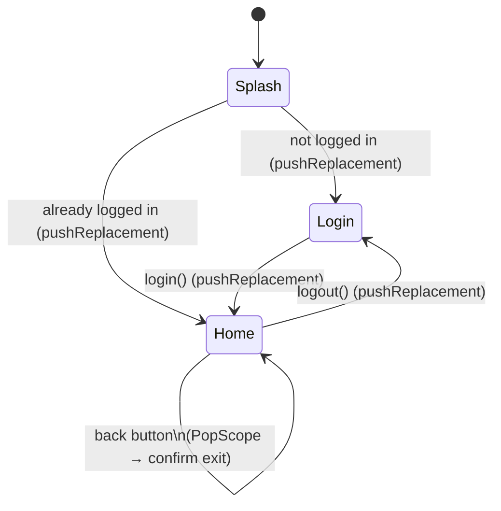

# Navigation

How Flutter's `Navigator` compares to React Navigation's stack, and how this project wires Splash → Login → Home together. The actual code lives in [`lib/screens/`](../screens/) (`splash_screen.dart`, `login_screen.dart`) and [`lib/main.dart`](../main.dart) (`MyHomePage`, which plays the role of "Home").

## 1. The stack, and how it maps to what you already know

Flutter's `Navigator` is a stack of `Route`s, same mental model as React Navigation:

```
[Splash] → push → [Splash, Login] → push → [Splash, Login, Home]
```

- **`push`** adds a route on top. **`pop`** removes the top route and goes back to whatever is now on top.
- There is **no "forward"**. Once a route is popped, its `State` is disposed — it doesn't sit in some forward-history waiting to be revisited, like a browser tab's forward button. This matches React Navigation, not the browser: the only way to see a popped screen again is to `push` a new instance of it.
- A route is a widget wrapped in something like `MaterialPageRoute` (gives you the platform's push/pop transition for free):
  ```dart
  Navigator.of(context).push(
    MaterialPageRoute(builder: (_) => const SomeScreen()),
  );
  ```

## 2. Push/pop family — what's available

| Method | What it does |
|---|---|
| `Navigator.push(route)` | Adds a route on top of the stack. |
| `Navigator.pop([result])` | Removes the top route; optionally hands a `result` value back to whoever `await`ed the `push`. |
| `Navigator.maybePop()` | Like `pop`, but does nothing (returns `false`) if the current route refuses to pop (e.g. it has unsaved changes) or if there's nothing below it. |
| `Navigator.canPop()` | Whether `pop` would actually do anything right now. |
| `Navigator.pushReplacement(route)` | Swaps the **current top route** for a new one. The old route is disposed and gone from the stack — going back afterward skips it entirely, landing on whatever was below it. **This is the one this project uses for Splash→Login/Home, Login→Home, and Home→Login (logout)** — see section 3. |
| `Navigator.popUntil(predicate)` | Pops repeatedly until `predicate(route)` is true (e.g. `route.isFirst`) — "go back several screens at once". |
| `Navigator.pushAndRemoveUntil(route, predicate)` | Pushes a new route and removes every route below it until `predicate` is true — "push this, and throw away everything back to X". Useful for "log out and nuke the whole stack down to a fresh Login", if a single `pushReplacement` isn't enough because there were several screens stacked on top of Home. |

There are also `*Named` variants (`pushNamed`, `pushReplacementNamed`, ...) that look up a route by a `String` name registered in `MaterialApp.routes`/`onGenerateRoute`, instead of building the widget inline. This project doesn't use named routes — screens are pushed directly by widget (`MaterialPageRoute(builder: (_) => const LoginScreen())`) since there are only 3 of them and no deep-linking need yet. If the app grows a lot of screens or needs URL-based deep links later, that's when reaching for named routes or a declarative router (`go_router`) starts paying off — not needed for this template today.

## 3. This project's flow



- **`SplashScreen`** ([`lib/screens/splash_screen.dart`](../screens/splash_screen.dart)) is `MaterialApp.home` — the very first route. Its `initState` awaits `ThemeController.instance.loadPersistedPreference()` and `LangController.instance.loadPersistedPreference()` (this used to run in `main()`, before `runApp`; it moved here once there was an actual screen to show meanwhile — see the theme/localization READMEs). Once loaded, it checks `AuthController.instance.isLoggedIn` and calls `pushReplacement` to either `LoginScreen` or `MyHomePage`.
- **`LoginScreen`** ([`lib/screens/login_screen.dart`](../screens/login_screen.dart)) is the app's "index" while logged out. Its button calls `AuthController.instance.login()` then `pushReplacement`s to `MyHomePage`.
- **`MyHomePage`** (in `main.dart`) is "Home". Its Settings tab has a Logout button calling `AuthController.instance.logout()` then `pushReplacement`ing back to `LoginScreen`.

`AuthController` ([`lib/controllers/auth_controller.dart`](../controllers/auth_controller.dart)) is intentionally a bare `ChangeNotifier` with an in-memory `bool isLoggedIn` — no real backend, no persistence. It exists only to drive this navigation demo; closing the app always resets it to logged out. Wiring it to real credentials/persistence is future work, same "later" as the theme/locale account-sync spot documented in those controllers.

### Why `pushReplacement` everywhere here, and not `push`/`pop`

Using `pushReplacement` at every one of these transitions is what makes "Login no longer reachable by going back once logged in" true: `pushReplacement` doesn't just add to the stack, it **removes the route it replaces**. So:

- After Splash → Home, the stack is just `[Home]` — Splash never existed as far as `pop` is concerned.
- After Login → Home, the stack is `[Home]` — Login is gone, not "beneath" Home. Pressing back on Home has nothing Login-related to return to.
- After Home → Login (logout), the stack is `[Login]` — Home is gone the same way. It's not deleted from the codebase, obviously — `MyHomePage` still exists and gets a **new** instance the next time `LoginScreen` pushes it, with fresh state (any typed-but-unsaved text, scroll position, etc. from the old instance is gone, since that old `State` was disposed).

If any of these had used `push` instead, the old screen would still be sitting in the stack, reachable by pressing back — which is exactly the behavior you don't want for a logged-out Login screen once you're in Home.

## 4. The hardware/gesture back button

By default, Android's back button (and iOS/Android's edge-swipe gesture) does `Navigator.maybePop()`: pop the current route if there's something to pop back to. **If there's nothing left to pop — i.e. the current route is the bottom of the stack — Flutter lets the platform handle it, which on Android means closing the app.** iOS has no hardware back button, so this specific concern is Android/gesture-only.

Since `MyHomePage` is always the stack's root once Login/Splash have been `pushReplacement`d away (section 3), pressing back on Home would, by default, instantly close the app — not what you generally want for a main screen.

`PopScope` (the current, non-deprecated replacement for the old `WillPopScope`) is how you intercept that:

```dart
return PopScope(
  canPop: false, // never let the system pop/exit on its own
  onPopInvokedWithResult: (didPop, result) {
    if (didPop) return; // canPop was true somehow; nothing to do
    _confirmExit(context); // show "exit app?" and SystemNavigator.pop() if confirmed
  },
  child: /* the actual Home content */,
);
```

- `canPop: false` tells the framework "don't pop (or exit) automatically when back is pressed — ask me first".
- `onPopInvokedWithResult` is the callback that fires on a back attempt. `didPop` tells you whether the pop actually happened (it won't, here, since `canPop` is `false`) — the `if (didPop) return;` guard is boilerplate for the case where `canPop` is conditionally `true` elsewhere; with it hardcoded to `false` it's always the "handle it yourself" branch.
- `_confirmExit` (in `main.dart`, right above `callDialog`) shows an `AlertDialog` and, only if the user confirms, calls `SystemNavigator.pop()` (from `package:flutter/services.dart`) — that's the actual "close the app" call; nothing does it automatically once `canPop` is `false`.

This is the same mechanism you'd use for "are you sure you want to discard this form?" on any screen — `PopScope` isn't specific to app-exit, it's a generic "intercept any attempt to leave this route, by any means (back button, gesture, or a programmatic `pop()`)".
